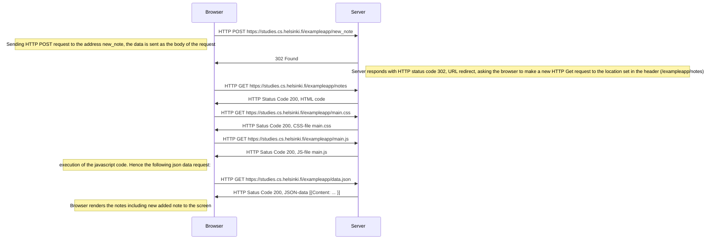
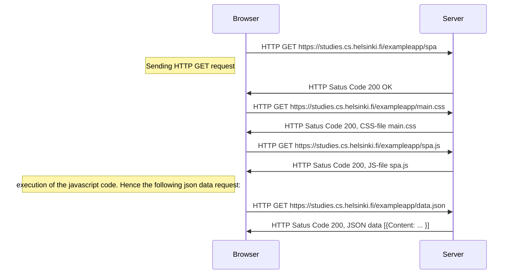
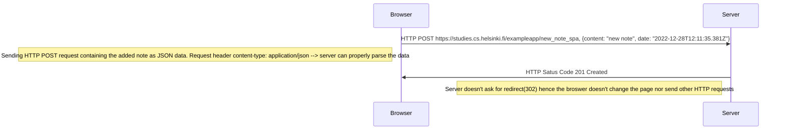

# FullStack22_23 Part 0 exercises

### 0.1 - 0.3
ei palauteta GitHubiin

### 0.4: New note diagram

```mermaid
sequenceDiagram
  participant Browser
  participant Server
  Browser->>Server: HTTP POST https://studies.cs.helsinki.fi/exampleapp/new_note
  Note left of Browser: Sending HTTP POST request to the address new_note, the data is sent as the body of the request
  Server->>Browser: 302 Found
  Note right of Server: Server responds with HTTP status code 302, URL redirect, asking the browser to make a new HTTP Get request to the location set in the header (/exampleapp/notes)
  Browser->>Server: HTTP GET https://studies.cs.helsinki.fi/exampleapp/notes
  Server->>Browser: HTTP Status Code 200, HTML code
  Browser->>Server: HTTP GET https://studies.cs.helsinki.fi/exampleapp/main.css
  Server->>Browser: HTTP Satus Code 200, CSS-file main.css
  Browser->>Server: HTTP GET https://studies.cs.helsinki.fi/exampleapp/main.js
  Server->>Browser: HTTP Satus Code 200, JS-file main.js
  Note left of Browser: execution of the javascript code. Hence the following json data request:
  Browser->>Server: HTTP GET https://studies.cs.helsinki.fi/exampleapp/data.json
  Server->>Browser: HTTP Satus Code 200, JSON-data [{Content: ... }]
  Note left of Browser: Browser renders the notes including new added note to the screen
```

### 0.5: Single Page App

```mermaid
sequenceDiagram
  participant Browser
  participant Server
  Browser->>Server: HTTP GET https://studies.cs.helsinki.fi/exampleapp/spa
  Note left of Browser: Sending HTTP GET request
  Server->>Browser: HTTP Satus Code 200 OK
  Browser->>Server: HTTP GET https://studies.cs.helsinki.fi/exampleapp/main.css
  Server->>Browser: HTTP Satus Code 200, CSS-file main.css
  Browser->>Server: HTTP GET https://studies.cs.helsinki.fi/exampleapp/spa.js
  Server->>Browser: HTTP Satus Code 200, JS-file spa.js
  Note left of Browser: execution of the javascript code. Hence the following json data request:
  Browser->>Server: HTTP GET https://studies.cs.helsinki.fi/exampleapp/data.json
  Server->>Browser: HTTP Satus Code 200, JSON data [{Content: ... }]
```

### 0.6: New note on single page app

```mermaid
sequenceDiagram
  participant Browser
  participant Server
  Browser->>Server: HTTP POST https://studies.cs.helsinki.fi/exampleapp/new_note_spa, {content: "new note", date: "2022-12-28T12:11:35.381Z"}
  Note left of Browser: Sending HTTP POST request containing the added note as JSON data. Request header content-type: application/json --> server can properly parse the data
  Server->>Browser: HTTP Satus Code 201 Created
  Note left of Server: Server doesn't ask for redirect(302) hence the broswer doesn't change the page nor send other HTTP requests
```
